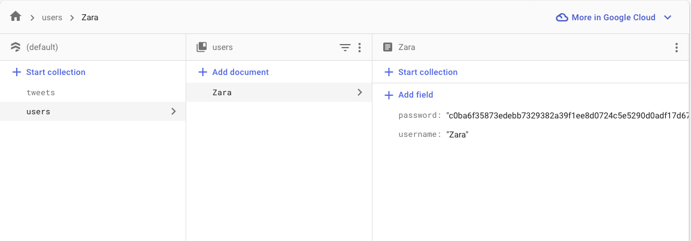

# Demo
Writing login & register routes with a JWT token. Stores user credentials on firebase with salted passwords
 
## Instructions 
- continue off of firebase demo code from last week
- new dependencies: pbkdf2, jsonwebtoken + add the requires at the top of the file
- Firebase db: 
    - Same db as last week
    - add a new collection titled "Users
    
- Write the register endpoint (no need to check password)
- Write the login endpoint
- Write the authMiddleware function
- Write the example protected route
- Update the post request (no longer need to pass in username + validateIput middleware updated)
- Show them how the token work/expire in Postman
    - Call the register to add a user
    - Login as that user
    - Try the protected endpoint and keep calling it till it expires, then get a new endpoint

